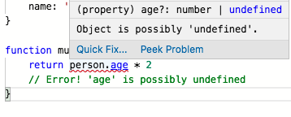
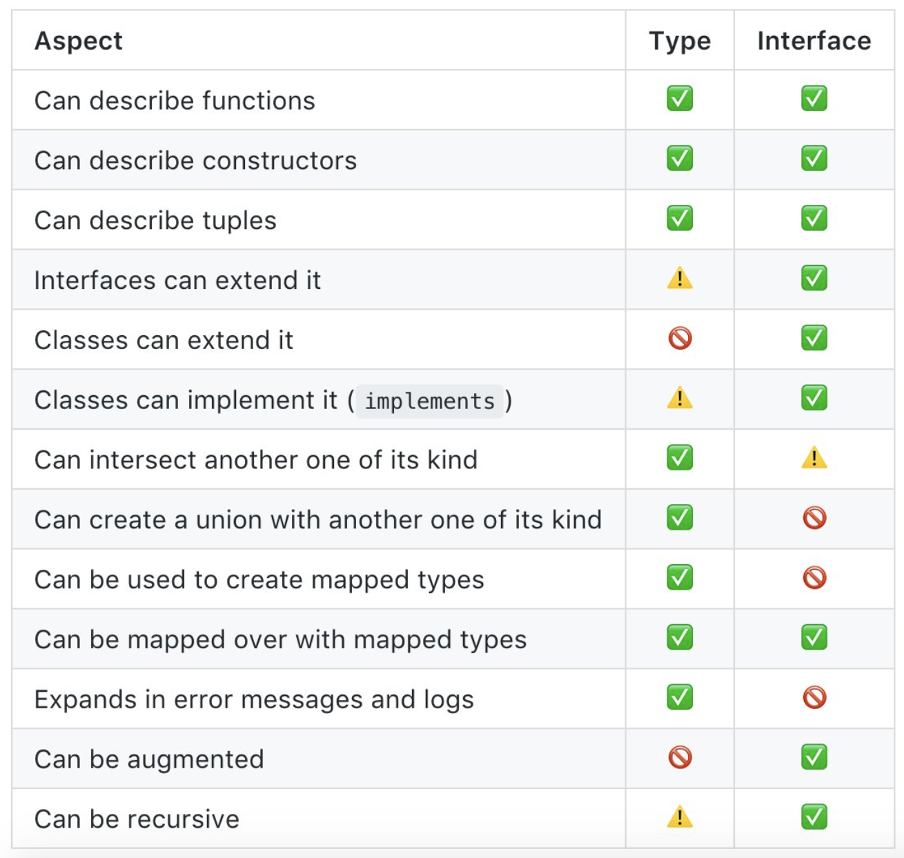

### TypeScript 101 <!--.element: class="fragment" -->

---

<div style="float: left; width: 45%;">
  
  <h1 style="font-size: 0.9em;">Bjorn Schijff</h1>
  <small style="display: inline-flex;">Frontend Software Engineer @ Politie</small>
  <br />
   <small>@Bjeaurn<br /> bjorn.schijff@ordina.nl</small>
</div>
<div style="float: right; width: 45%;">
  
  <h1 style="font-size: 0.9em;">Martin van Dam</h1>
<small style="display: inline-flex;">Frontend Software Engineer @ Philips</small>
  <br />
  <small>@MrtnvDam<br />martin.van.dam@ordina.nl</small>
</div>

---

### What is TypeScript?
Anyone?

----

* Superset of JavaScript
* Adds types to JavaScript
* Compiles back to JavaScript
* ESNext features
* Open source, maintained by Microsoft

---

### Why would you use TypeScript?

----

* Scalability
* Stricter programming
* Readability
* Less chance to write errors and bugs
* Easier to refactor

---

### Using TypeScript

* Angular
* Libraries such as RxJS
* Babel, ESLint
* Great support for other frameworks as well (React, Vue)
* ts-node for running directly in Node
* And many more!

---

### Typescript is your friend

* The compiler is there to help you!
* The errors can be a bit cryptic, but are usually not complex.

---

Let's look at the following scenario:

```js
// JavaScript ES6
const person = { name: 'Henk', age: 22 };
const person2 = { name: 'Piet' };

function multiplyAge(person) {
  return person.age * 2;
}

multiplyAge(person); // what would be the result?
multiplyAge(person2); // And here?
```

----

```ts
// TypeScript
type Person = {
  name: string
  age?: number
}

const person: Person = {
  name: 'Henk'
}

function multiplyAge(person: Person) {
  return person.age * 2 
  // Error! 'age' is possibly undefined
}
```
----



This is there to help you!

----

### So what are the advantages here?

----

* **Readability** — Clear intention what the function expects.
* **Strictness** — You cannot do certain things until the compiler is certain something is possible.
* **Safety** — You can be certain when the compiler agrees, that you will not see anything weird in the runtime.

---

## ⚠️ Participation alert ⚠️

### Please join us from here on out!

---

Let's install TypeScript!

```sh
# npm
npm install typescript

# or with yarn
yarn add typescript

# No global install, you can do this optionally yourself!
```

```sh
mkdir typescript-101
cd typescript-101
npx tsc --init
```

----

### npx tsc --init
- Creates a `tsconfig.json`
- Sets up the default configuration for your TypeScript project

----

```ts
{
  "compilerOptions": {
    /* Basic Options */
    "target": "es5",                          /* Specify ECMAScript target version: 'ES3' (default), 'ES5', 'ES2015', 'ES2016', 'ES2017', 'ES2018', 'ES2019' or 'ESNEXT'. */
    "module": "commonjs",                     /* Specify module code generation: 'none', 'commonjs', 'amd', 'system', 'umd', 'es2015', or 'ESNext'. */
    // "lib": ["dom"],                             /* Specify library files to be included in the compilation. */
    // "declaration": true,                   /* Generates corresponding '.d.ts' file. */
    // "declarationMap": true,                /* Generates a sourcemap for each corresponding '.d.ts' file. */
    // "sourceMap": true,                     /* Generates corresponding '.map' file. */
    // "outFile": "./",                       /* Concatenate and emit output to single file. */
    // "outDir": "./",                        /* Redirect output structure to the directory. */
    // "rootDir": "./",                       /* Specify the root directory of input files. Use to control the output directory structure with --outDir. */
    /* Strict Type-Checking Options */
    "strict": true,                           /* Enable all strict type-checking options. */
  }
}

```

----

### Writing your first TypeScript

```sh
touch index.ts 
code .        # for VSCode users
```

```ts
console.log('Hello TypeScript!');
```

```sh
npx tsc index.ts
node index.js

# or if you want with ts-node (npm install ts-node)
npx ts-node index.ts
```

```html
touch index.html

<!doctype html>
<html>
<head>
  <script src="index.js"></script>
</head>
</html>
```

---

## TSLint or ESLint
Normally we would add a linter here, but with the current roadmap it's uncertain which one is the way forward.

You use a linter to enforce or disable certain "patterns" of coding. This enforces a team coding standard.<!--.element: class="fragment" -->

For advanced sessions or private studying. 😉<!--.element: class="fragment" -->

(We use it to disable semicolons, etc.)<!--.element: class="fragment" -->

---

### Basic types

----

### Types in Javascript

```js
typeof 'some string' // -> string
typeof 123 // -> number
typeof true // -> boolean
typeof undefined // -> undefined
typeof { key: 'value' } // -> object
typeof ['array', 'values'] // -> object
typeof function(){} // -> function
```
Types available in Javascript: `string`, `number`, `boolean`, `undefined`, `object`, `function`.

Basic typechecking is done in runtime.

----

### But we can do much better than this!

TypeScript offers a lot more options to make your code typesafe.

Typechecking is done during compile time and is removed from the compilation result.

----

String
```ts
const myName: string = 'Martin'
const myLastName: string = 123
// Error! Type '123' is not assignable to type 'string'.
```

Number
```ts
const myAge: number = 29
const daysLeftThisYear: number = '100'
// Error! Type '"100"' is not assignable to type 'number'.
```

----

String Literal
```ts
let myType: 'A' | 'B' = 'A'
myType = 'B' // Works!
myType = 'Z' // Error! Type '"Z"' is not assignable to type '"A" | "B"'.
```

Number Literal
```ts
let myType: 1 | 2 = 1
myType = 2 // Works!
myType = 9 // Error! Type '9' is not assignable to type '1 | 2'.
```

----

```ts
export type TextFileTypes = 'pdf' | 'doc' | 'md'

function acceptTextFile(
  fileName: string,
  fileType: TextFileTypes) {
    // Do things
}

acceptTextFile('bla.jpg', 'jpg') // Error!
```

----

Boolean

```ts
const hasChildren: boolean = true
const amountOfChildren: boolean = 22 // Error! Type '22' is not assignable to type 'boolean'.
```

Null / Undefined
  
```ts
const u: undefined = undefined;
const n: null = null;
```

Any

Avoid where possible! Removes your typesafety!

```ts
const myAge: number = 28
const yourAge: string = myAge // Error! Type 'number' is not assignable to type 'string'.
const yourAge: any = myAge // Works!
```

----

Array
  
```ts
const days: string[] = [ 'Monday', 'Tuesday', 'Wednesday' ]
const years: number[] = [ 2018, 2019, 2020 ]

const dates: number[] = [ 1, 2, '3' ] // Error! Type 'string' is not assignable to type 'number'.
const dates2: Array<string | number> = [ 1, 2, '3' ] // Works!
```

Tuple

```ts
const tuple: [ string, number ] = [ 'age', 28 ]
const otherTuple: [ string, string ] = [ 'a', 'b', 'c' ] // Error! Types of property 'length' are incompatible. Type '3' is not assignable to type '2'.
```

----

Enum

```ts
enum ResponseCode {
  OK = 200,
  NOT_FOUND = 404
}

function getResponse(isOk: boolean): ResponseCode {
  if (isOk) {
      return ResponseCode.OK
  }

  return ResponseCode.NOT_FOUND
}
```

----

Object

```ts
const myObject: object = { name: 'Henk' }
const notAnObject: object = 1 // Error! Type '1' is not assignable to type 'object'.
```

Record

Looks like an object but is strict.

```ts
const myRecord: Record<string, number> = { age: 22 }
const myOtherRecord: Record<string, number[]> = { ages: [ 22, 65 ] }
const faultyRecord: Record<boolean, string> = ... // Error! Type 'boolean' does not satisfy the constraint 'string | number | symbol'.
```

----

Never
    
Should -never- happen
```ts
function isHenk(name: 'Henk' | 'Piet') {
  switch(name) {
    case 'Henk':
      return true
    case 'Piet':
      return false
    default:
      const exhaustive: never = name
      throw exhaustive
  }
}
```

The compiler will let you know when you forgot adding a `case` for an expected value.

---

### Exercises basic types
Copy `exercises/1_js_toTypescript.js` and turn it into a Typescript file. 

Make it as typesafe as you can!

---

### `const` vs `let`

```ts
let myVar = 'my value'
// What will be the type of `myVar`?

const myOtherVar = 'my other value'
// What will be the type of `myOtherVar`?
```

---

### Interfaces & Type Aliases

```ts
interface Person {
  name: string
  age: number
}
```

Mainly used to define the expected shape of data coming from the outside.

----

Optionals

```ts
interface Person {
  name: string
  age?: number // this is optional
}
```

Handy when a value is sometimes not available

----

Extending

```ts
interface Person {
  name: string
  age: number
}

interface ExtendedPerson extends Person {
  birthDate: Date
  gender: 'male' | 'female'
}
```

----

Overriding

```ts
interface File {
  name: string
  icon: string
}

interface WordDocument extends File {
  icon: 'word'
}
```

This example narrows the `icon` `type` in a `WordDocument` object.

----

Readonly 

```ts
interface Person {
  readonly name: string
  age: number
}

const person: Person = { name: 'Henk', age: 22 }
person.name = 'Piet' // Error! Cannot assign to 'name' because it is a read-only property.
```

Doesn't actually enforce immutability, but makes sure that on compile time; we're not reassigning any readonly values.

---

Type aliases

Almost the same as `interface` but;
* Is not extendable
* Is not overridable
* Different syntax

```ts
type Person = {
  name: string
  age: number
}
```

----

```ts
export type FileId = string
export type FileTypes = 'pdf' | 'doc' | 'txt' | 'md'

export interface File {
  id: FileId
  type: FileTypes
  name: string
  // etc.
}
```

---



---

### Exercise 2
Take `exercises/2_json_to_types.ts`, create interfaces and types for the data. 

Make it as typesafe as you can of course!

---

### Classes

Comparable to what you see in Java, PHP, etc.

----

In ES5

```js
var MyClass = /** @class */ (function () {
  function MyClass(name) {
    this.name = name;
  }
  return MyClass;
}());
```

----

ES6 / ES2017

```js
class MyClass {
  constructor(name) {
    this.name = name
  }
}
```

----

### Auto assignment

```ts
class MyClass {
  constructor(public name: string) {}
}
```

```js
// Transpiles to
class MyClass {
  constructor(name) {
    this.name = name; // We get this assignment for free!
  }
}

```
<!--.element: class="fragment" -->

----

### Access modifiers

`private` vs. `protected` vs. `public`

Makes parts of a class accessible and visible to external implementation.

```ts
class Controller {
  constructor(private isActive: boolean) {}

  getIsActive() { // public is default on methods.
    return this.isActive
  }

  protected protectedIsActive {
    return this.getIsActive()
  }
}

const controller = new Controller(false)
controller.protectedIsActive()
controller.isActive 
// Error! Property 'isActive' is private and only accessible within class 'DroneController'.
```

----

```ts
class User {
  constructor(private id: string, public name: string) {}
}
```

```ts
const me = new User('12345-abcd', 'my.user.name')
console.log(me.id) 
// ERROR: Property 'id' is private and only accessible within class 'User'.
```

----

### Inheritance (implements)

```ts
interface IDroneController {
  isActive: boolean
}

class DroneController implements IDroneController {
  // ERROR:
  // Class 'DroneController' incorrectly implements interface 'IDroneController'.
  // Property 'isActive' is missing in type 'DroneController' but required in type
  // 'IDroneController'.
}
```

Useful when you have multiple implementations, but they need to adhere to a standard. Compiler prevents you from forgetting a method or variable. 

----

### Inheritence (extends)

 ```ts
class Controller {
  isActive: boolean

  constructor(isActive: boolean) {
    this.isActive = isActive
  }

  getIsActive(): boolean {
    return this.isActive
  }
}

class DroneController extends Controller {
  altitude: number

  constructor(isActive: boolean, altitude: number) {
    super(isActive)
    this.altitude = altitude
  }

  getState() {
    return {
      isActive: super.getIsActive(),
      altitude: this.altitude
    }
  }
}

const drone = new DroneController(true, 0)
```

Useful to create classes with the same basis, to prevent duplicate code and enforcing business rules.

----

### Inheritence (Abstract)

```ts
abstract class Controller {
  private isActive: boolean

  constructor(isActive: boolean) {
    this.isActive = isActive
  }

  protected abstract blieb(): void // must be implemented in derived classes
}

class DroneController extends Controller {
  constructor(isActive: boolean) {
    super(isActive)
  }

  protected blieb() {
    MOTORS.zoom()
  }
}
```

----

### Readonly
```ts
class Controller {
  readonly isActive: boolean

  constructor(isActive: boolean) {
    // we can only assign readonlys in the constructor
    this.isActive = isActive
  }

  someFunction() {
    this.isActive = false // Error! Cannot assign to 'isActive' because it is a read-only property.
  }
}

const controller = new Controller(true)
controller.isActive = // Error! Cannot assign to 'isActive' because it is a read-only 
```

----

### Getters and Setters

```ts
// Meh
class Controller {
  isActive: boolean
}

const controller = new Controller()
controller.isActive = true

const controllerState = controller.isActive // true
```

----

### Getters and Setters

```ts
// Yeah!
class Controller {
  private _isActive: boolean

  get isActive(): boolean {
    return this._isActive
  }

  set isActive(isActive: boolean) {
    this._isActive = isActive
  }
}

const controller = new Controller()
controller.isActive = false // Calls the `isActive()` function with set in front.

const controllerState = controller.isActive // false
```

Getters and Setters gives us more control about getting and setting state.

----

### Static
```ts
class Controller {
  static type: string = 'drone'

  static blieb() {
    // make some noise
  }
}

const controllerType = Controller.type // 'drone'

Controller.blieb() // makes noise!
```

Static properties or methods are available without constructing the class.

---

### Exercise 3

`exercises/3_refactor_me.js`

Use classes, functions and interfaces/types to refactor a JS file into a more typesafe and readable format.

---

### Exercise 4

`exercises/4_js_with_bug_to_ts.js`

The given JS file contains a bug. Refactor to TypeScript and see if you can isolate and fix the bug by increasing typesafety.

---

### Functions

Without types:

```ts
const minutesToSeconds = (minutes) => {
  return minutes * 60
}
```

----

With parameter- and return type:

```ts
const minutesToSeconds = (minutes: number): number => {
  return minutes * 60
}
```

----

 Or we can just use the Function Type:

```ts
type MinutesToSeconds = (minutes: number) => number

const minutesToSeconds: MinutesToSeconds = (minutes) => {
  return minutes * 60
}
```

----

Optional parameters:
```ts
const multiply = (a: number, b?: number) => {
  return a * b // Error! Object is possibly 'undefined'.
}
```

```ts
const multiply = (a: number, b?: number) => {
  if (b === undefined) {
    return 0
  }

  return a * b // Works!
}
```

----

Default parameter:

```ts
const multiply = (a: number, b: number = 0) => {
  return a * b // Works!
}
```

---

### Exercise 5 - Function types

`exercises/5_function_types.ts`

See if you can write Function types for the provided functions.

```ts
type MyFunction = (input: string) => string
const myFunction: MyFunction = input => input
```

---

### Exercise 6

`exercises/6_ts_to_better_ts.ts`

We already have a TypeScript file. But it can be improved. See what you can do to make it more strict!

Hint: You can think of string literal types and Function Types.

---

### import / export

When using or creating external tools and libraries, we `import from` and `export` our TypeScript elements. This way the compiler knows what to share and where to look for certain parts.

----

```ts
// ./a.ts
export type TypeA = 'string'
export class A {
  constructor(readonly type: TypeA) {}
}
```

```ts
// ./b.ts
import { TypeA, A } from './a' // relative path, so ./a.ts
import { Example } from 'external-lib' // node_modules

const a = new A(Example.name)
```

---

### @types/...

Type definition for non-TypeScript libraries

https://github.com/DefinitelyTyped/DefinitelyTyped

More than 6.640 type definitions for libraries/projects

----

### How to use type definitions

```bash
npm install react
npm install @types/react
```

```ts
import React from 'react' // no need to use `@types/... here`
...
```

----

### custom.d.ts

Lets say we use an untyped library:

```ts
import { sayHello } from 'say-hello'

sayHello('Hello!')

// Error! Cannot find module 'say-hello'.
```

----

We can make a declaration for this library ourself:

```ts
// say-hello.d.ts
declare module 'say-hello' {
  export function sayHello(input: string): void
}
```

----

### Pros
- Flexibility
- Immediately available
- Only declare what you need

----

### Cons
- Potentially dangerous
- Maintenance

----

Use DefinitelyTyped where possible!

https://github.com/DefinitelyTyped/DefinitelyTyped

---

### Wrap-up

- What is TypeScript
- How to use it
- TypeScript compiler
- Basic Types
- Type definitions

---

### Resources

- https://www.typescriptlang.org/docs/home.html
- https://github.com/DefinitelyTyped/DefinitelyTyped

---

### Intermediate / Advanced TypeScript

Let us know if you want to continue learning TypeScript! We also have an advanced course available.

---

### 🙌 Thanks 🙌

Questions anyone?

----

<div style="float: left; width: 45%;">
  
  <h1 style="font-size: 0.9em;">Bjorn Schijff</h1>
  <br />
   <small>@Bjeaurn<br /> bjorn.schijff@ordina.nl</small>
</div>
<div style="float: right; width: 45%;">
  
  <h1 style="font-size: 0.9em;">Martin van Dam</h1>
  <br />
  <small>@MrtnvDam<br />martin.van.dam@ordina.nl</small>
</div>